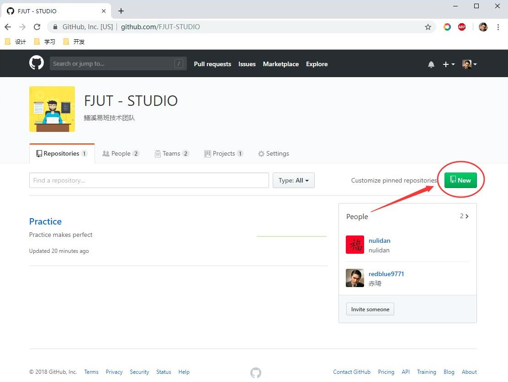
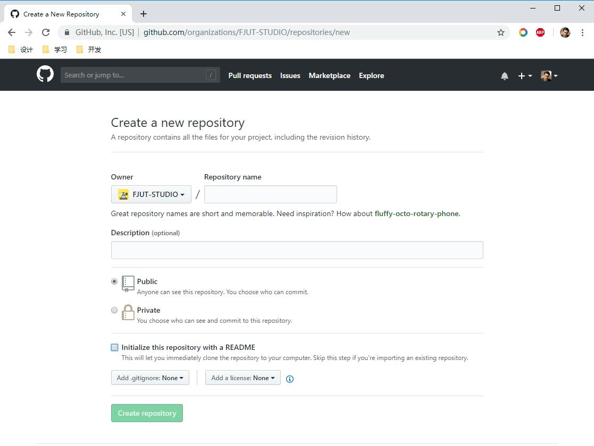
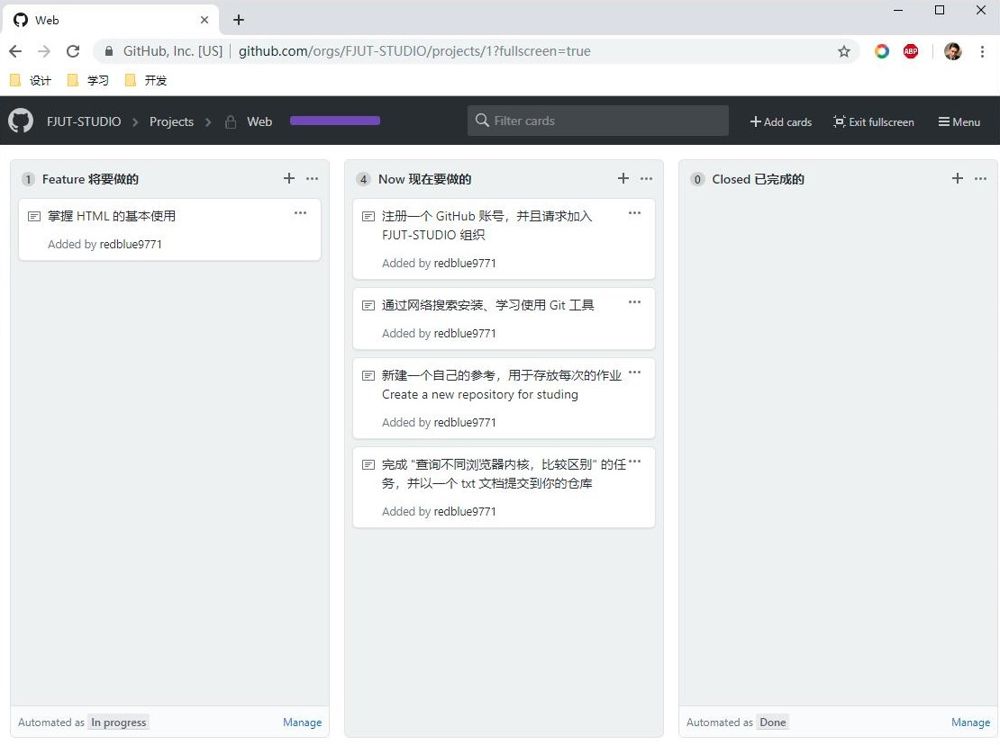

# 任务
每日（周）的任务：[https://github.com/orgs/FJUT-STUDIO/projects/1](https://github.com/orgs/FJUT-STUDIO/projects/1)

## 使用

1. 打开组织页面

2. new 一个以你名字全拼为名的 repository

3. 在组织的 Projects/web 里面查看每日(周)待办

4. git clone 你的仓库到本地，完成任务后，再 git push 到远端，完成！

## 个人作业地址汇总
|名字|Github| 
|--------|-----:| 
|高阳|[https://github.com/redblue9771](https://github.com/redblue9771/)|
|吴春燕|[https://github.com/nulidan](https://github.com/nulidan)|

## 关于
技术部：[https://github.com/FJUT-STUDIO](https://github.com/FJUT-STUDIO)
